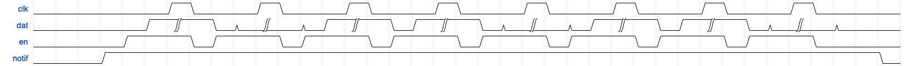

# 4wire


## What's 4wire?

A protocol, that let's 2 microcontrollers, or any other device (eg. RPi SBC-s) communicate via 4 standard GPIO pins reliably

[Projects already using 4wire](references.md)

## Disclaimer

The software provided does not come with any warranty and CyberHorizon can not be held responsible under any circumstances for problems caused by the code.

## License

Developed by CyberHorizon
GitHub: https://github.com/cyberhorizon
Website: https://cyberhorizon.com

This software is provided 'as-is', without any express or implied warranty.
In no event will the authors be held liable for any damages arising from its use.
Permission is granted to anyone to use this software for any purpose,
including commercial applications, and to alter it and redistribute it freely,
subject to the following restrictions:

1. The origin of this software must not be misrepresented; you must not claim
   that you wrote the original software. If you use this software in a product,
   an acknowledgment in the product documentation would be appreciated but is not required.
2. Altered source versions must be plainly marked as such and must not be misrepresented
   as being the original software.
3. This notice may not be removed or altered from any source distribution.


## Development, support and contribution

### Development

Every time we use 4wire in a new environment, we will upload that specific library here

### Support

We will try our best to answer each question. Feel free to open an issue

### Contribution

- Create a pull request / issue
- If properly documented (meaning we can test it) and it works as expected, we will add it to the repository and credit you

## Libraries
```
Note: The pins defined in the files provided are the tested and recommended pins
Note: When running the code on ESP32 devices, it is recommended to disable watchdog, or set a timeout on the function call
```
### Raspberry

#### Pico

- [Pico SDK C++ sender](sources/rpi_pico_pico_sdk_sender.cpp)
- [MicroPython sender](sources/rpi_pico_micropython_sender.py)

#### Pi 5
- [Python receiver](sources/rpi_5_receiver.py)

### ESP32

#### WROOM 32

- [C++ sender](sources/esp32_wroom32_sender.cpp)
- [C++ receiver](sources/esp32_wroom32_receiver.cpp)

### Heltec

#### WiFi Lora v3

- [C++ receiver](sources/heltec_wifi_lora_v3_receiver.cpp)
- [C++ sender](sources/heltec_wifi_lora_v3_sender.cpp)

### Windows 11

#### Files as bits 

```
objectively the best way for 2 programs to communicate
used as POC for development
```

- [Python receiver](sources/win11_file_receiver.py)
- [Python sender](sources/win11_file_sender.py)

### Ubuntu

#### Files as bits 

```
objectively the best way for 2 programs to communicate
used as POC for development
```

- [C++ receiver](sources/ubuntu_file_receiver.cpp)
- [C++ sender](sources/ubuntu_file_sender.cpp)

## QuickStart guide

- define / set the pins correctly in the code on both ends
- connect the defined pins with the same name
- enjoy


## How does it work?

### Hierarchical model

#### Sender

Controls the following lines:
- clock
- data
- notify

#### Receiver

Controls the following lines:
- enable

### Flow description

- Receiver waits
  - until notify is high
- Sender sets
  - data to low
  - clock to low
  - notify to high
- Receiver sets
  - enable to high
- Receiver waits
  - until clock is high
- Sender sets
  - data to a bit of data
  - clock to high
  - clock to low
- Sender waits
  - until enable is low
- Receiver sets
  - buffers item to the bit
  - enable to low
- Receiver waits
  - until clock is high
- Keep repeating the steps, until
  - Sender sets notify to low

```
example for sending '10110110' or 'm'
```


